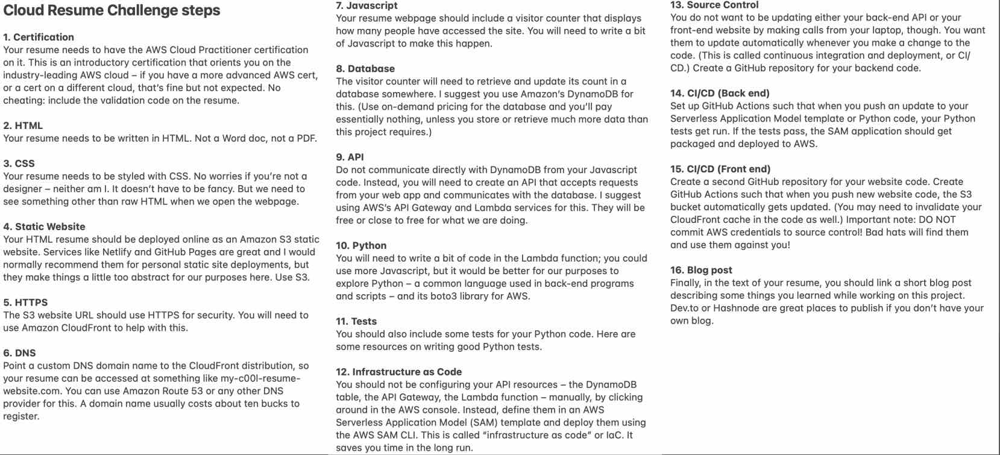

# Challenging parts

* [Back to README](../README.md)

Below I explain some of the *challenging* bits of the cloud resume challenge.
It is quite detailed/technical and mainly for my own reference.

## Introduction

In the process of completing this project I kept extensive notes on what I did, including both what worked and what didn't along the way.

In a way this was out of habit; during my physics PhD days, I found it extremely useful in research projects to maintain a list of "approaches that didn't work" and accompanying notes.
This serves mainly two purposes:

1. It prevents wasting time by falling down similar rabbit holes in the future.
1. It's more productive to respond to *"Have you tried doing X?"* from senior team members with *"Yes I have, it didn't work, and here's why..."*, instead of the lackluster *"Yes, and it doesn't work"*.
  

Beyond that, in scientific research it is rarely enough to simply know the correct way to solve a problem.
You also have to deeply understand why the solution works, and debugging dead ends is a great way to do that.
Anyway, here is my abbreviated list of things that didn't work and why.

## Challenge steps

For reference here are the steps from the original challenge broken into 3 chunks.

*Source: https://cloudresumechallenge.dev*

## First chunk - steps 1-6

* In steps 1-6 I had to figure out configuring HTTPS and DNS, rather than relying on a managed service such as AWS Amplify or Netlify or GitHub Pages.
  I had not done anything like this before.

    * Figuring out how to get Route 53 to coordinate with CloudFront -- which delivers content from my S3 bucket -- was the first challenging part of the project.
      I needed to simultaneously create a certificate with ACM to enable HTTPS rather than HTTP in order for my site to be publically accessible, so this part involved three separate services.
      I had to debug different HTTP error codes to figure out which of these services needed configuring further.
      
    * I also noted an idiosyncrasy of AWS: creating the HTTPS certificate has to be done specifically in the us-east-1 region.
      After initially creating it in the Sydney region (ap-southeast-2), where the rest of my resources exist, I was clueless about why I still was getting a 403 error, but this was quickly fixed.

    * This chunk also contained a non-AWS task: my domain registrar, Cloudflare, needed the details of the AWS nameservers of my Route 53 Hosted zone in order to communicate that information to the top level domain name (.com) nameservers.

* I noted a number of other common traps/gotchas during steps 1-6.

    * I implemented infrastructure as code early on in the project by using an AWS SAM template and manually adding to it the other resources I needed in the form of CloudFormation code as I went.
      I quickly realised that deploying the infrastructure becomes painfully slow if you delete a resource in the management console rather than removing it from your template file and running an update to delete it.
      Due to the way CloudFormation manages state, the best approach is to always delete resources with the template file.

    * Figuring out IAM permission sets for single-sign-on users in IAM Identity Center was not intuitive.
      I realised that you can change inline policies as much as you like and it affects nothing unless you simultaneously assign the permission set a name and then directly refer to that name in your AWS CLI `~/.aws/config` file. 
      (This took nearly a full day of head-scratching to figure out)

* It turned out that figuring out the coordination between CloudFront, S3, Route 53, and ACM was easier to do using infrastructure as code rather than in the management console. 
  I never got it running with my initial attempts in the management console before deciding it would be a good idea to use CloudFormation from the very beginning.

## Middle chunk - steps 7-12

* For steps 7-10 (the front-end/back-end integration) I faced some difficulty in getting my DynamoDB table to update correctly when using the python SDK boto3 with the `.update_item` method. 
  This turned out to be a trivial miss-spelling on my part but I found the error message (`ParamValidationError`) unhelpful, mainly because it does *not* point you to the specific code line in the python lambda handler which causes the error -- a feature I would typically rely on when writing python code.

    It was only by slowly going through the documentation and checking every argument line by line that I found my typo.
    I think there must be a better way to debug lambda handlers than this, maybe via some kind of code linting tool for AWS Lambda, but it was okay in this case because the python code was short.

## Final chunk - steps 13-16

* Regarding CI/CD testing: from my DynamoDB table I only retrieve the hit count `visits` for the number of website visits to the API endpoint, which should be stored as a `Number` data type in DynamoDB.
  
    * This is because the `.update_item` method for DynamoDB tables with the arguments `UpdateExpression = 'ADD visits :val', ExpressionAttributeValues = {':val': 1}` requires the existing attribute (here: `visits`) to be a `Number` data type.

    At some point during development the `visits` attribute accidentally changed its data type to become a string and therefore stopped updating when refreshing the webpage.

    To signal this failure I have added into my unit tests an `assert` statement to ensure the data type is as expected.
    However, at present my solution is to just fix it in the management console whenever the test fails, which is less than ideal. 
    Automating this fix is listed in [things I would do if I had more time](If%20I%20had%20more%20time.md).

* Setting up GitHub actions: 
  To ensure I followed best security practices, I did not rely on storing AWS credential files on my machine throughout this project.
  This was enabled by using federated users within IAM Identity center managed through AWS Organizations.

    Accommodating for this set-up required a little extra work configuring [OpenID Connect](https://docs.github.com/en/actions/deployment/security-hardening-your-deployments/about-security-hardening-with-openid-connect) with AWS which is the recommended approach [according to AWS](https://github.com/aws-actions/configure-aws-credentials#assumerolewithwebidentity-recommended).
    This approach is preferred to simply storing credentials as GitHub repository secrets, because it works by generating tokens that last for only 1 hour each and it does not create any long-lasting credentials in the first place.